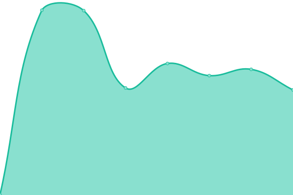

# [📈 Live Status](https://SANDBOX-COPRS.github.io/upptime): <!--live status--> **🟩 All systems operational**

This repository contains the open-source uptime monitor and status page for [SANDBOX-COPRS](https://SANDBOX-COPRS.github.io/upptime), powered by [Upptime](https://github.com/upptime/upptime).

With [Upptime](https://upptime.js.org), you can get your own unlimited and free uptime monitor and status page, powered entirely by a GitHub repository. We use [Issues](https://github.com/SANDBOX-COPRS/upptime/issues) as incident reports, [Actions](https://github.com/SANDBOX-COPRS/upptime/actions) as uptime monitors, and [Pages](https://SANDBOX-COPRS.github.io/upptime) for the status page.

<!--start: status pages-->
<!-- This summary is generated by Upptime (https://github.com/upptime/upptime) -->
<!-- Do not edit this manually, your changes will be overwritten -->
<!-- prettier-ignore -->
| URL | Status | History | Response Time | Uptime |
| --- | ------ | ------- | ------------- | ------ |
|  [Google](https://www.google.com) | 🟩 Up | [google.yml](https://github.com/SANDBOX-COPRS/upptime/commits/HEAD/history/google.yml) | 

 79ms
     
 | 

<a href="https://SANDBOX-COPRS.github.io/upptime/history/google">100.00%</a>
    

|  [Artifactory](https://artifactory.coprs.esa-copernicus.eu) | 🟩 Up | [artifactory.yml](https://github.com/SANDBOX-COPRS/upptime/commits/HEAD/history/artifactory.yml) | 

 625ms
     
 | 

<a href="https://SANDBOX-COPRS.github.io/upptime/history/artifactory">100.00%</a>
    

|  [SonarQube](https://sonarqube.coprs.esa-copernicus.eu) | 🟩 Up | [sonar-qube.yml](https://github.com/SANDBOX-COPRS/upptime/commits/HEAD/history/sonar-qube.yml) | 

 664ms
     
 | 

<a href="https://SANDBOX-COPRS.github.io/upptime/history/sonar-qube">100.00%</a>
    

|  [Vault](https://vault.coprs.esa-copernicus.eu) | 🟩 Up | [vault.yml](https://github.com/SANDBOX-COPRS/upptime/commits/HEAD/history/vault.yml) | 

 618ms
     
 | 

<a href="https://SANDBOX-COPRS.github.io/upptime/history/vault">100.00%</a>
    

|  [Squash](https://squash.coprs.esa-copernicus.eu/squash) | 🟩 Up | [squash.yml](https://github.com/SANDBOX-COPRS/upptime/commits/HEAD/history/squash.yml) | 

 841ms
     
 | 

<a href="https://SANDBOX-COPRS.github.io/upptime/history/squash">100.00%</a>
    

<!--end: status pages-->

[**Visit our status website →**](https://SANDBOX-COPRS.github.io/upptime)

## 📄 License

- Powered by: [Upptime](https://github.com/upptime/upptime)
- Code: [MIT](./LICENSE) © [SANDBOX-COPRS](https://SANDBOX-COPRS.github.io/upptime)
- Data in the `./history` directory: [Open Database License](https://opendatacommons.org/licenses/odbl/1-0/)
